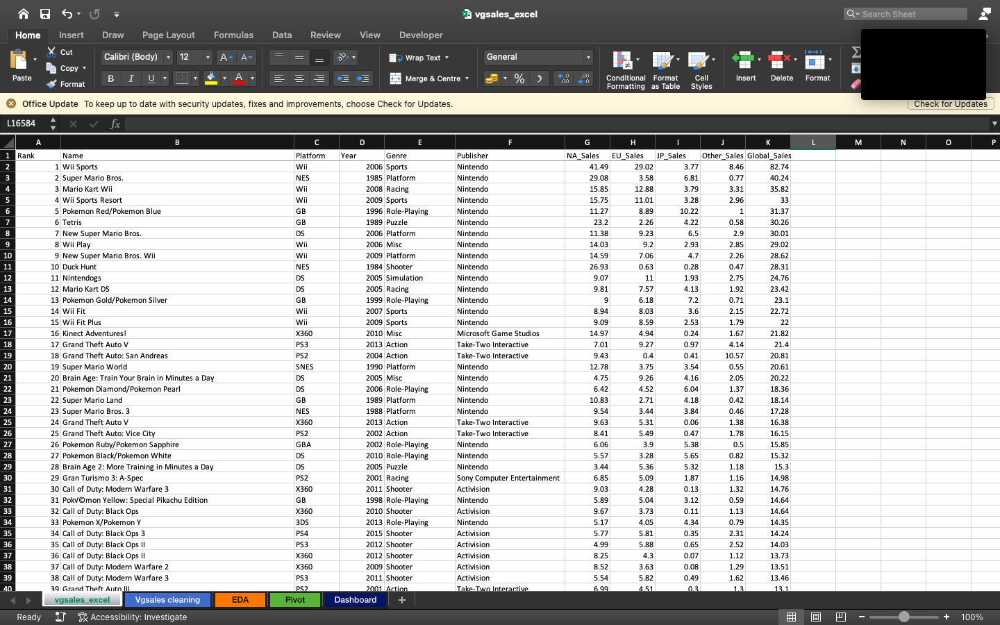
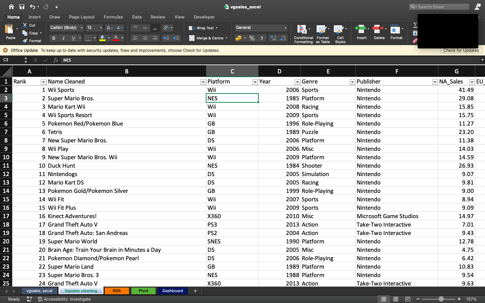
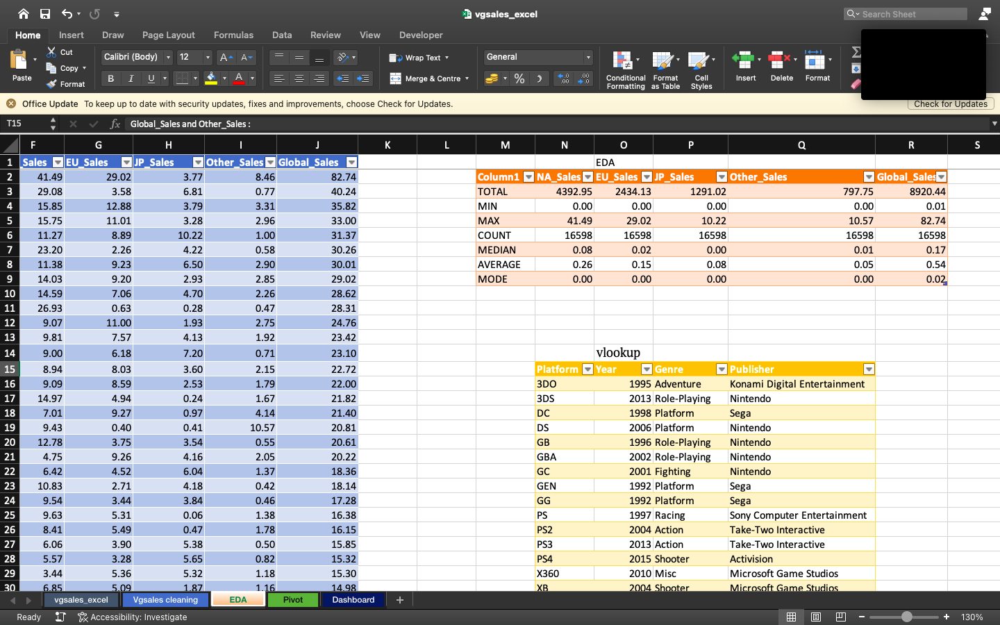
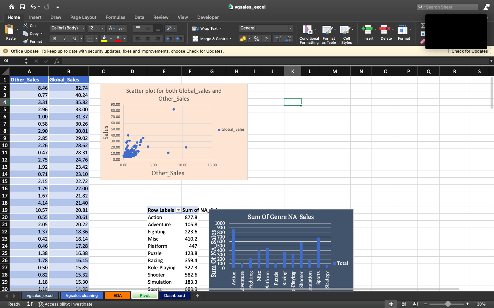
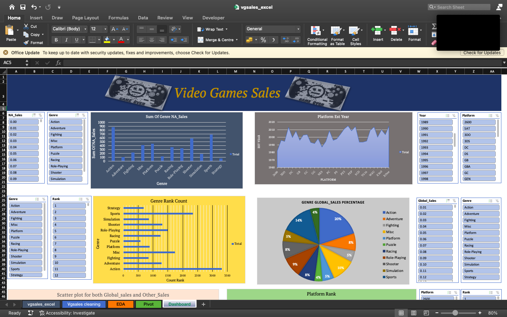

# Video Games Data


# Video Games DataSet

The Video Games Dataset is a structured collection of information about various video game titles across different platforms and years. 
It’s commonly used for data analysis, visualization, and machine learning projects.
This repository project follows the data cleaning, EDA, Pivot Tables and Visualization using Microsoft Excel on the video games sales dataset.
This data contains over 165999 rows and 11 columns(Rank, Video Game Name, Gaming Platform(Ps3), Year, Genre, Publisher, Na_sales, EU_sales, Jp_sales, Other_sales, Global)

## Features
- **Data Collection**: Utilizes public Video Games sales datasets from Kaggle which gathers historical data.
- **Data Preprocessing**: Includes data cleaning(using =Substitute methods, =if conditions, handling missing values.
- **Data EDA**: Includes performing VLOOKUP on the dataset, Aggregate data (sum, count, average, max, Mode, Median, Min)
- **Data Pivot**: Includes Group by categories (Year, Genre, Rank). Compare data (e.g. Na_sales by Year vs. Gaming platform). Filter & sort dynamically. Spot trends, patterns, and outliers
- **Visualization**: Creating an Interactive Dashboard.

## Installation
1. Clone the repository:
   ```bash
   git clone https://github.com/Brian342/Video-Games-Sales-Excel.git
   cd Video-Games-Sales-Excel
   ```

## Screenshots
Here are some visual representations of the project:

### Video Games Sales Dataset 


### Cleaning  


### EDA  


### Pivot tables 


### Dashboard


## License
This project is licensed under the MIT License. See the LICENSE file for more details.
